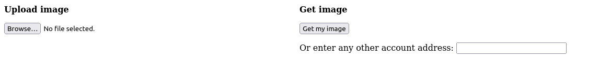
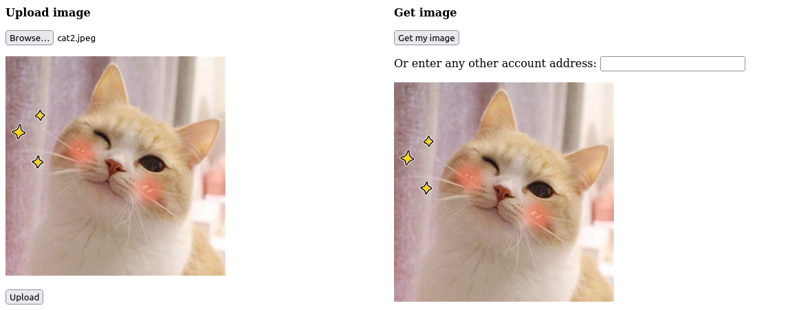

# Homework 8

#### _“Peer-to-peer networks and consensus”_

Simple DApp allows users to associate images with their ethereum addresses.  
Files are stored in IPFS, their hashes are stored in Ethereum [smart-contract](contracts/IPFSMapping.sol).  
Authentication via metamask.

Libraries/frameworks used:
+ [Hardhat](https://hardhat.org/) for blockchain
+ [ethers](https://docs.ethers.org/v5/) for interaction with blockchain
+ [ipfs-http-client](https://github.com/ipfs/js-ipfs/tree/master/packages/ipfs-http-client#readme) for interaction with ipfs
+ [SvelteKit](https://kit.svelte.dev/) for UI

## How to run

### IPFS Node

+ Install Kubo: [link](https://docs.ipfs.tech/install/command-line/)
+ Initialize repository:
  ```shell
  ipfs init
  ```
+ Allow CORS:
  ```shell
  ipfs config --json API.HTTPHeaders.Access-Control-Allow-Origin '["*"]'
  ipfs config --json API.HTTPHeaders.Access-Control-Allow-Methods '["GET", "POST"]'
  ```
+ Run daemon
  ```shell
  ipfs daemon
  ```
  
### Local eth node
+ Start local node
  ```shell
  npx hardhat node
  ```
+ Deploy contract
  ```shell
  npx hardhat run --network localhost scripts/deploy.cjs
  ```
+ Add local network to metamask and change its Chain ID to `31337`
+ Add some accounts with eth given by node to metamask.

### Frontend

+ Configure ipfs node address and contract address in [svelte.config.js](svelte.config.js)
+ Run web app
  ```bash
  npm run dev
  ```
+ Authorise with Metamask. You can now use the app!
  
  To upload image use left side. Metamask should ask you to sign transaction  
  To get your or any others image use right side.
  

## Tests
Tiny test can be run with 
```shell
npx hardhat test
```
